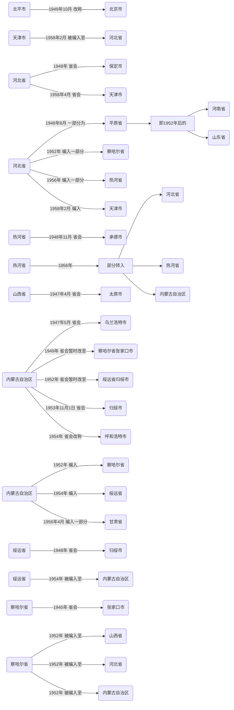

译自：[http://www.abiweb.jp/report/china3.htm](http://www.abiweb.jp/report/china3.htm)

*终于只剩最后一篇文章了......*

*博主得到了「中国向け地下放送録音集　デジタルリマスター版」的原版录音。该录音为无删减、无压缩，文件现已上传至[“I BCL. 文件库”](https://f.ibcl.us)，欢迎各位前往下载～[链接直达](https://f.ibcl.us/%E7%94%B5%E5%8F%B0%E9%9F%B3%E9%A2%91/%E4%B8%AD%E5%9B%BD%E5%90%91%E3%81%91%E5%9C%B0%E4%B8%8B%E6%94%BE%E9%80%81%E9%8C%B2%E9%9F%B3%E9%9B%86%20CD%E7%89%88/)。*

> 图为延安新华广播电台后来所使用的发射机，由国民党的美制导航台改装而成（图片来源于网络）。

# 建国初期（华北地区，省市级）

<!--more-->

> 《省级、地区、市级》

## 华北地区

|电台名称|简史| 
|--------|----|
|北京人民广播电台|1949年2月2日，北平新华广播电台开始广播|
||1949年3月，改称北平人民广播电台，北平（北京）新华广播电台第二台改称北京市人民广播电台|
||1951年3月1日，改称北京人民广播电台|
|天津人民广播电台|1949年1月15日，天津新华广播电台开始广播|
||1949年5月15日，改称天津人民广播电台|
|河北人民广播电台|1949年9月1日，保定人民广播电台开始广播|
||1951年4月1日，改称河北人民广播电台|
|唐山人民广播电台|1948年12月13日，唐山新华广播电台开始广播|
||1949年7月2日，改称唐山人民广播电台|
|山西人民广播电台|1949年4月25日，太原新华广播电台开始广播|
||1949年6月，改称太原人民广播电台|
||1950年1月1日，设立太原人民广播电台第二台|
||1950年12月20日，改称山西人民广播电台|
||1951年10月4日，第一台面向全山西省，第二台面向太原市广播|
||1952年1月1日，山西人民广播电台、太原人民广播电台分离（1953年1月，废除太原人民广播电台）|
|平原人民广播电台|1950年3月10日，新乡人民广播电台开始广播|
||1951年，改称平原人民广播电台|
||1952年11月30日，停止广播|
|察哈尔人民广播电台|1948年12月24日，重建张家口新华广播电台，并开始广播|
||1949年5月1日，改称张家口人民广播电台，增开第二台面向全察哈尔广播|
||1950年11月30日，第二台改称察哈尔人民广播电台|
||1951年4月22日，张家口人民广播电台停止广播，与察哈尔台合并|
||1952年12月6，废除察哈尔省，停止广播|
|绥远人民广播电台|1950年初，改称归绥人民广播电台|
||1952年，改称绥远人民广播电台|
||1954年，绥远省并入内蒙古自治区，绥远台成为内蒙古人民广播电台|
|包头人民广播电台|1949年9月，开始广播|
||1953年，自制电台节目停止，转播中央台|
||1956年6月1日，再次开始自制电台节目|
|内蒙古人民广播电台第二台|1950年11月1日，内蒙古乌兰浩特人民广播电台开始广播|
||1951年春，决定在内蒙古自治区人民政府所在地设置内蒙古人民广播电台第一台|
||1951年5月1日，乌兰浩特台改称内蒙古人民广播电台第二台|
||1954年7月1日，迁至海拉尔|
||1955年1月，成为呼伦贝尔的盟局|
||1969年7月，呼伦贝尔盟划入黑龙江省，改称呼伦贝尔人民广播电台|
|内蒙古人民广播电台|1954年，绥远省并入内蒙古自治区，省会归绥改称呼和浩特，成为自治区首府|
||1954年3月6日，绥远人民广播电台改称内蒙古人民广播电台|

*同样的，我制作了与原文对应的，建国前至五十年代，华北地区的行政区划变迁图。*

*这是使用Mermaid绘制的流程图，了解一下。*

以上11个电台（算上太原，张家口即为13个电台）中，北京人民广播电台、天津人民广播电台为直接管辖（天津市从1958年2月到1967年12月降至河北省辖区），唐山人民广播电台、包头人民广播电台分别由河北省唐山市、绥远省（后改为内蒙古自治区）包头市所负责。其他7个电台则由省、自治区负责。

“解放区”时期，在华北最早设立的广播分别是是张家口新华广播电台（1945年8月），邯郸新华广播电台（1946年9月）。但是由于张家口台面向晋察冀解放区进行广播，邯郸台面向晋冀鲁豫解放区进行广播，所以到1948年年底，上述两台均合并至中央局陕北新华广播电台。

三大战役之一的“平津战役”（1948年12月5日~ 49年1月）后，1948年12月24日张家口解放，张家口新华广播电台也重建（上述张家口新华广播电台迁至阜平后改称为晋察冀新华广播电台，最后合并至陕北台）。虽然现在张家口属于河北省，但在当时却是察哈尔省省会。1952年察哈尔省废除后分割给了内蒙古自治区、山西省、河北省，但最后张家口的广播也被中止。

另一方面，当时的河北省省会保定在1949年设立了广播局，1951年改称河北人民广播电台。1958年，省会转至天津，于是河北台也从保定迁至天津，并与天津台合并，后称“河北天津人民广播电台”。但在1960年4月，两者再次分离开来。天津市再次成为直辖市后，河北省会改回保定，于是河北台也再次回到了保定。1968年，石家庄成为了省会城市，于是河北台又迁至此地。

1947年5月，全兴安省以及辽北省、察哈尔、嫩江省的一部分都被合并到内蒙古自治区，首府定为乌兰浩特。由于直到1949年9月下旬西部地区还没有解放。1949年12月，自治区人民政府、中共内蒙古分局决定暂时迁至张家口（察哈尔省省会）。

1950年11月，内蒙古乌兰浩特广播电台开始广播。这是由党、政府机关所设立的广播电台，一旦政府机关移动，电台也将一同移动。这是极为罕见的例子。

1951年春，内蒙古自治区人民政府所在地决定设置内蒙古人民广播电台第一台。据说这能实现第一台能覆盖西部地区，第二台覆盖东部地区的构想。

1951年5月1日，内蒙古乌兰浩特人民广播电台改称内蒙古人民广播电台第二台。1954年5月，电台与中共内蒙古分局东部工作委员会一同迁至海拉尔（7月开始广播）。但由于1955年东部工作委员会被废除，于是广播局在呼伦贝尔盟委员会的指导下成为了盟局。1969年，呼伦贝尔盟被划入黑龙江，于是改称呼伦贝尔人民广播电台。

1952年，自治区人民政府和内蒙古分局迁至绥远省归绥。此外，1954年，绥远省合并至内蒙古自治区，首府归绥改称为呼和浩特。绥远人民广播电台改称内蒙古人民广播电台。

根据平津战战役的描述，1949年1月15日*（ABI原文错写成了1948年）*，天津解放，天津新华广播电台并于当日开始广播。北平解放于1月31日，北平新华广播电台（面向北平市）则于2月2日开始广播。

1949年3月25日，陕北台迁至北平，在北平新华广播电台成为中央电台的同时，北平市原有的新华电台不得不则改称北平人民广播电台。不过，此时北平并没有其他名为“人民广播电台”的电台。

5月份时，各地都着手将台呼从“XX新华广播台”改为“XX人民广播电台”。可不知怎么的，9月1日时却出现了北平新华广播电台第二台（即为北平人民广播电台）。

到12月时，北平新华广播电台第二台的名称又改成了“北京市人民广播电台”，直到1951年3月，才渐渐改成了更顺口，且现在还在使用的“北京人民广播电台”。

另外，平原人民广播电台属于自1949年8月到1952年所设置的平原省广播局。该省的省会为新乡。

（西田邦浩）

---

本文重新录入了刊登在「アジア放送研究月報」上的内容（本稿は「アジア放送研究月報」に掲載されたものを再録しました）。

---

 - 稍作删改，不过并未改变本意。
 - 原创不易，转载时请注明原文链接，在此不胜感激。
 - 对于翻译中存在争议的地方，烦请不吝赐教。

Copyright © 2016-2018 I BCL.
All rights reserved.